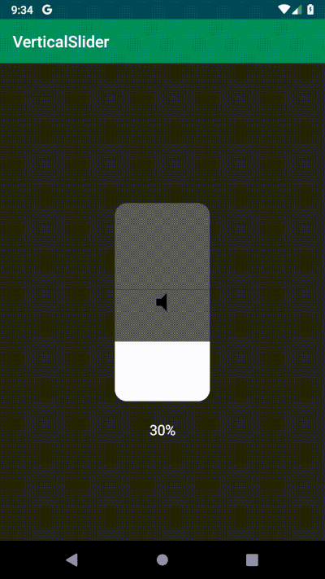

# Vertical Slider for Android

Have you ever seen those sleek volume and light sliders for iOS? Well here they are for Android as an extremely lightweight library.



It allows to set 3 different icons for different states of the slide: low, medium and high.

## Usage
As always it is available through jCenter:

```groovy
implementation 'com.hmomeni.verticalslider:verticalslider:0.1.3'
```

You can set them both in xml or code:

```xml
<com.hmomeni.verticalslider.VerticalSlider
        android:id="@+id/verticalSlider"
        android:layout_width="120dp"
        android:layout_height="250dp"
        app:layout_constraintBottom_toBottomOf="parent"
        app:layout_constraintEnd_toEndOf="parent"
        app:layout_constraintStart_toStartOf="parent"
        app:layout_constraintTop_toTopOf="parent"
        app:vs_iconHigh="@drawable/volume_high"
        app:vs_iconLow="@drawable/volume_low"
        app:vs_iconMedium="@drawable/volume_medium"
        app:vs_max="100"
        app:vs_progress="10" />
```

```kotlin

verticalSlider.onProgressChangeListener = object : VerticalSlider.OnSliderProgressChangeListener {
            override fun onChanged(progress: Int, max: Int) {
                // use progress and max to calculate percentage
            }
        }
```